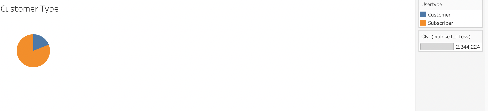
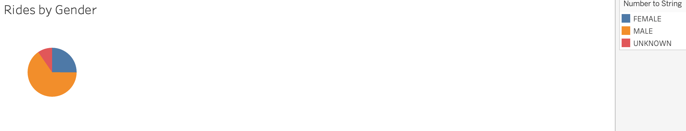
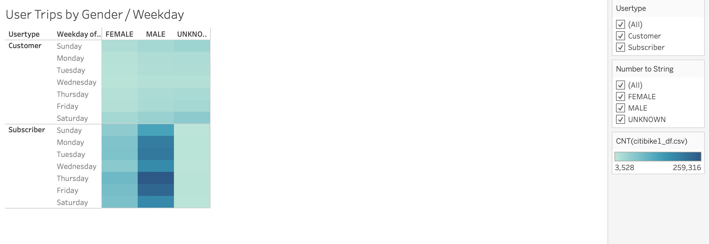
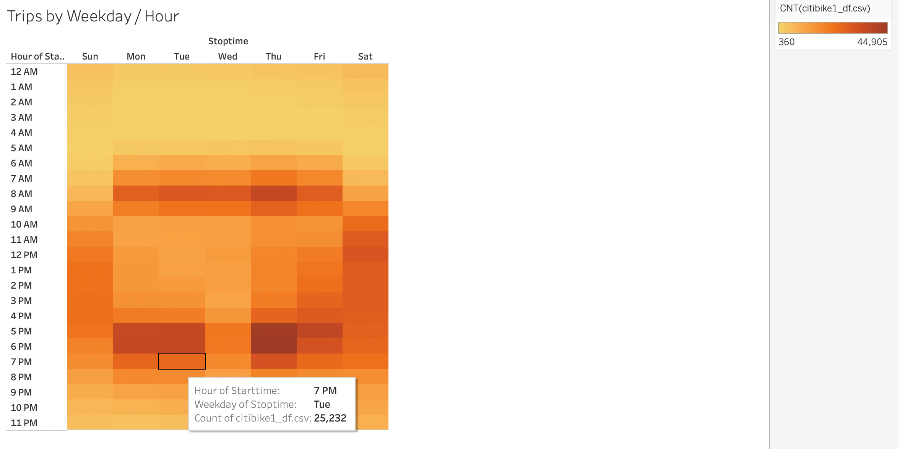
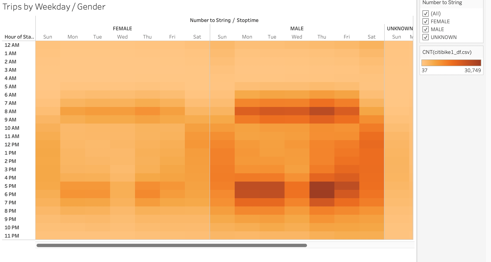
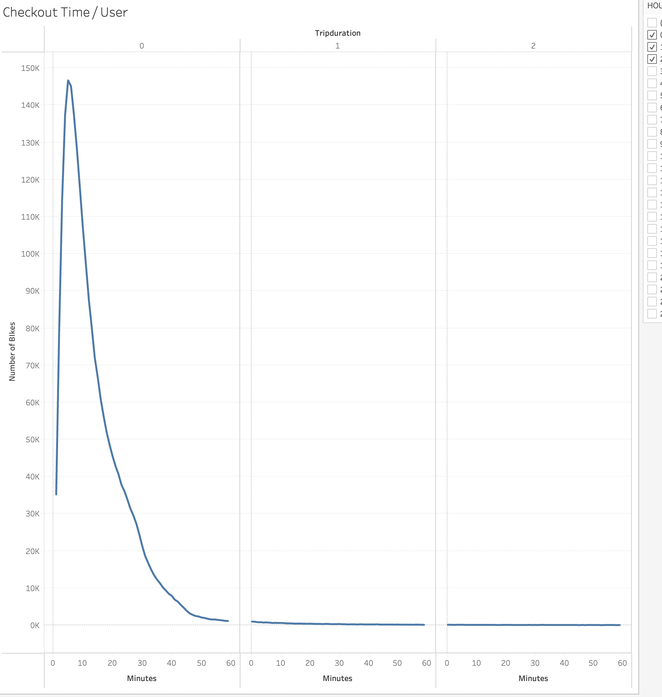
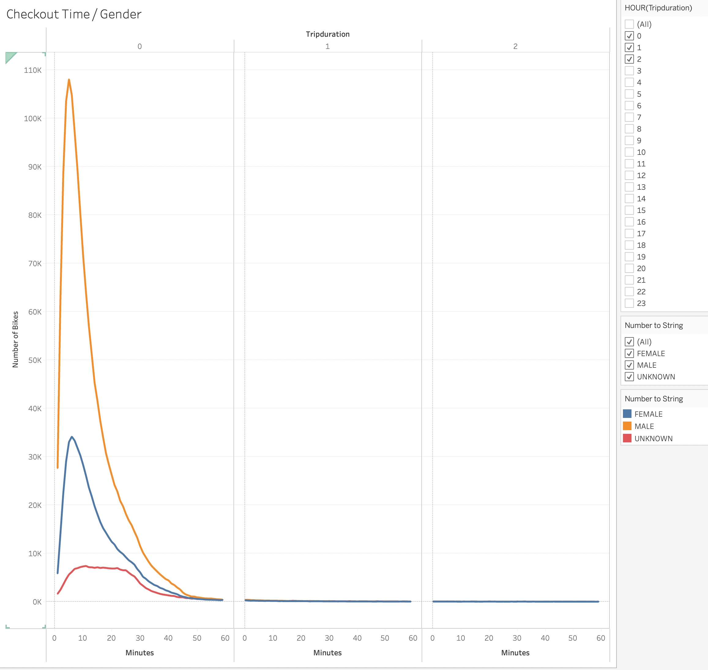

# Bikesharing
## Overview
The purpose of this project is to take bike sharing data from New York City and use it to build a proposal to a similiar program in Des Moines. The Tableau story can be seen [here](https://public.tableau.com/app/profile/john.schelling/viz/SchellingModule14Challenge/CitiBIkeStory).
## Results
Of the data provided from the New York City bike sharing data, there were two different types of users, subscriber based customers, and single use customers. The month of August saw a total of over two million bikes used, with over 75% of these being used by users using subscriptions to the citibike program. As can be seen below. 

Out of all the user types, when it came to gender, a majority of the users who utilized the bike sharing program where males, with around 60% of total users being male.
.
Usage of the bike sharing program in New york city also differed drastically between male in females, with male users using the program heavily throughout the week, and females not using the program as frequently. Male usage was highest Thursday and Friday.

When it comes to usage of the bikes, usage through the week is heaviest from 7AM-9AM, picking up again on weedays from 4PM-7PM.  Weekends however, had a consistent about of usage from 9AM-4PM.
.
When comparing usage between male and females throughout the week, usage is pretty similar in regards to the usage in the morning and afternoons in the wekdays, and consistently throughout the days on weekends. The only exception being male usage is significantly greater.

Most trips lasted less than an hour, with nearly 150,000 of the trips lasting only five minutes. The amount of trips that lasted over an hour decreased significantly from trips lasting less than an hour.

The overall trend for the duration of time that bikes are checked out was similiar between different genders, with males taking up a significant amount of the bikes, with over 100,000 trips, and females making up less thatn 40,000 trips. Both male and female trips duration spiked significantly in the first 60 minutes of thte trip, decreasingly signficantly into the first hour and second hour.

## Summary
In conclusion, subscription based memberships seem to be a popular form for users to utilize the bike sharing program in New York City. Based off of the usage throughout the times of the week, it seems that most of the users utilize the bikes to get to and from work, since there is a spike in usage in the morning, and afternoon. 
Males utilize the bike sharing program significantly more then females as well, and the use of surveys amongst populations in NYC and Des Moines could help paint a picture of why that is. 
Overall, if a simliar program would be started in Des Moines, it would be beneficial to create it an an area where in which parking is limited, as is in NYC, where people can easily use the program to get to and from work, and encourage users to use the program with the creation of a membership based subscription.
